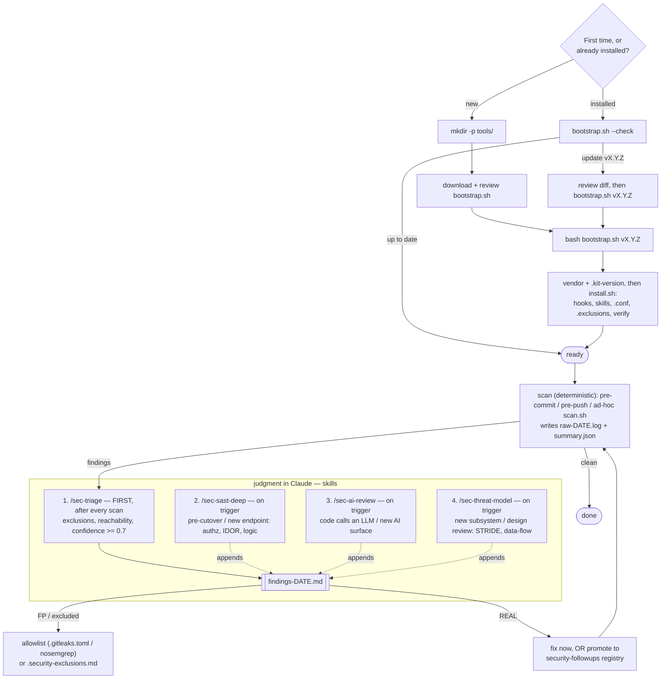

# security-audit-kit — tasinabilir yerel guvenlik tarama

[](https://github.com/boraeresici/security-audit-kit/actions/workflows/ci.yml)
[](https://github.com/boraeresici/security-audit-kit/actions/workflows/self-audit.yml)
[](LICENSE)
[](https://github.com/boraeresici/security-audit-kit/releases)

> 🌐 **English:** [README.md](README.md) · **Türkçe:** bu dosya
>
> Yukaridaki **self-audit** badge'i dogfooding: kit kendi `secret` + `sast` taramasini bu
> repo uzerinde [`.github/workflows/self-audit.yml`](.github/workflows/self-audit.yml) ile kosar.

CI'a (ve faturasina) bagimli olmadan, **herhangi bir git repo'sunda** yerel
guvenlik taramasi koşturan, hook'larla otomatik tetikleyen ve bulgu triyajini
bir Claude skill'ine baglayan kendi-kendine yeten kit.

Kapsanan boyutlar: **sir** (gitleaks), **SAST** (semgrep), **bagimlilik CVE**
(pip-audit + pnpm/yarn/npm), **IaC misconfig** (checkov), **container/fs**
(trivy), **SBOM** (syft) ve **opsiyonel cok-ekosistem bagimlilik CVE** boyutu
(`scan.sh osv` — OSV-Scanner, py/js/go/rust/…). Eksik toolchain olan boyut otomatik atlanir.

Bunlarin ustune dort Claude skill'i yargi katmani ekler: **`sec-triage`** (ham tarama ->
gercek/FP karari -> fix/allowlist), **`sec-sast-deep`** (semgrep'in pattern'le goremedigi
*semantik* kod aciklari: yatay authz/IDOR, dikey authz/eksik-rol, business-logic,
semantik/stack-ozel injection — cagri-yolu izleyerek), **`sec-ai-review`** (OWASP LLM Top 10'a gore AI/LLM riskleri:
prompt injection, guvensiz cikti islemesi, asiri yetki) ve **`sec-threat-model`** (STRIDE +
data-flow ile saldiri yuzeyi tehdit modeli). Son ucu `scan.sh`'a girmez (yargi, script
degil); periyodik/cutover-oncesi/yeni-endpoint, AI-yuzeyi veya yeni-subsystem sonrasi
Claude'da kosulur.

Secmek istemiyor musun? **`sec-audit`** tek-komut orchestrator: scan + triage'i ve repoya
*gercekten uyan* deep paslari (kor degil, sinyal-gated) kosar, hepsini tek findings dosyasinda
toplar.

## Yasam dongusu (kurulum → guncelleme → tarama)



Skill sirasi: **`/sec-triage` once kosar** (her bulgulu taramadan sonra; `findings-DATE.md`
yazar, FP→allowlist/exclusions vs GERCEK→fix/takip ayirir). **`/sec-sast-deep`** ve
**`/sec-ai-review`** daha derin, tetik-bazli pas; ciktilari ayni dosyaya eklenir.

Guncelleme **acik (manuel)**: `--check` yalniz raporlar (salt-okunur, kurmaz);
`bootstrap.sh <tag>` re-vendor + install kosar. Hicbir sey upstream'i otomatik cekmez —
tag'e pinle, diff'i incele, yukselt.

## Kurulum (onerilen): bu repo'dan pinli bootstrap

`bootstrap.sh` kiti **pinli bir tag**'te ceker, projenin `tools/security-audit-kit/`'ine
vendor'lar, sonra `install.sh`'i kosar. Hedef repo kokunden calistir:

```bash
# 1) Bootstrap scriptini indir ve ONCE OKU (shell'e pipe etme):
curl -fsSL https://raw.githubusercontent.com/boraeresici/security-audit-kit/main/bootstrap.sh \
  -o bootstrap.sh && less bootstrap.sh
# 2) Bir tag'e pinleyerek kos:
bash bootstrap.sh v1.0.0
bash bootstrap.sh v1.0.0 --scan          # kurulumdan sonra tam tarama da kos
bash bootstrap.sh v1.0.0 --expect=<sha>  # pini dayat: ref baska commit'e cozulurse reddet
```

> `bootstrap.sh` icindeki `KIT_REPO` varsayilan olarak bu repo'ya isaret eder. Fork'tan
> vendor'lamak icin override et: `KIT_REPO=https://… bash bootstrap.sh v1.0.0`.

`install.sh` (bootstrap'in cagirdigi): prerequisite'leri raporlar -> `core.hooksPath`'i
kitin hooks klasorune isaretler -> `sec-triage` + `sec-sast-deep` skill'lerini
`.claude/skills/`'e kopyalar. Idempotent, tekrar kosulabilir.

## Diger kurulum yollari

Ikisi de kiti hedef repoda `tools/security-audit-kit/` altina koyar, sonra repo
kokunden `install.sh` kosulur (hook'lar bu path'i hardcode eder).

**Klonla, sonra kopyala** — air-gapped, ya da once tum repo'yu incelemek istersen:
```bash
git clone https://github.com/boraeresici/security-audit-kit.git
mkdir -p /hedef/proje/tools
cp -R security-audit-kit /hedef/proje/tools/security-audit-kit
cd /hedef/proje && bash tools/security-audit-kit/install.sh
```

**Zaten kuran bir projeden kopyala** — offline, ag yok; ayni vendor kopyayi baska bir
yerel repoya yatay tasi:
```bash
cp -R /proje-a/tools/security-audit-kit /proje-b/tools/
cd /proje-b && bash tools/security-audit-kit/install.sh
```

## pre-commit framework ile (kitin kendi hook'larina alternatif)

Zaten [pre-commit](https://pre-commit.com) kullaniyorsan, kitin git hook'lari yerine onu
`.pre-commit-config.yaml`'ine ekle:

```yaml
- repo: https://github.com/boraeresici/security-audit-kit
  rev: v1.6.0          # bir tag'e pinle
  hooks:
    - id: sec-staged   # her commit: staged-secret taramasi
    - id: sec-deps     # bagimlilik manifesti degisince: CVE audit
    - id: sec-all      # pre-push / manual: tam tarama
```
```bash
pre-commit install                         # sec-staged + sec-deps
pre-commit install --hook-type pre-push    # sec-all
```

**Ya** pre-commit framework **ya da** kitin kendi hook'lari (`install.sh` / `core.hooksPath`)
kullan, ikisi birden degil (`core.hooksPath` pre-commit'i golgeler). Hook'lara dokunmadan
yalniz Claude skill'leri + config icin: `bash tools/security-audit-kit/install.sh --skills-only`.

Neden bu bicim (kitin kendi felsefesiyle tutarli):
- **`curl | bash` YOK.** Bu bir *guvenlik* aracidir — indir, gozden gecir, sonra
  calistir. Uzaktan scripti dogrudan shell'e pipe etmek tam da kitin uyardigi
  anti-pattern'dir.
- **Pinleme pratikte zorunlu.** Hareketli ref (`main`) "CI ile drift yok" vaadini
  bozar; tag/SHA vermezsen bootstrap uyarir. `.kit-version` (ref + cozulen SHA)
  yazar — commit'lersen tum takim tek pinli surumu paylasir. `--expect=<sha>` ile pini
  **dayatabilirsin** (ref baska commit'e cozulurse reddeder); ayrica pinli bir ref'i
  yeniden vendor'larken farkli commit'e tasinmissa (tag-repoint korumasi) `--allow-ref-change`
  vermeden reddedilir.
- **Auto-scan opt-in** (`--scan`), varsayilan DEGIL — kitin **kapi (hook,
  deterministik) ↔ yargi (`/sec-triage`, Claude gerekir)** ayrimina saygi.
- **Idempotent.** Yeni pinli surume gecmek icin
  `bash tools/security-audit-kit/bootstrap.sh <yeni-tag>` (vendor kopyayi ust-yazar,
  `.security-audit.conf`'unu korur).

**Upstream guncelleme isteyen takimlar icin alternatif:** kiti bootstrap-kopya
yerine git `submodule`/`subtree` olarak vendor'la. Daha agir (submodule surtunmesi);
yalniz kit repo'sundan `git`-takipli guncelleme istiyorsan deger.

### Guncellemeyi fark etme + uygulama

Bootstrap **kopya (vendor)** yapar — projenin `git`'i kit repo'sunu takip etmez,
yani "upstream degisti" demez. Iki yolla ogrenirsin:

1. **`--check` (yerlesik, salt-okunur).** Vendor'daki `.kit-version`'i kit
   repo'sundaki en son semver tag ile `git ls-remote` uzerinden karsilastirir
   (clone yok):
   ```bash
   bash tools/security-audit-kit/bootstrap.sh --check
   # vendored version : v1.0.0
   # latest tag       : v1.1.0
   # !! UPDATE AVAILABLE -> bash tools/security-audit-kit/bootstrap.sh v1.1.0
   ```
   Cikis kodu: `0` = guncel, `1` = guncelleme var — periyodik kontrol veya bir
   `make` hedefine baglanabilir.
2. **Kit repo'sunun release'lerini izle** (GitHub Watch → Custom → Releases): yeni
   tag cikinca bildirim alirsin.

**Guncellemeyi uygula** (idempotent — vendor kopyayi ust-yazar,
`.security-audit.conf`'unu korur):
```bash
bash tools/security-audit-kit/bootstrap.sh v1.1.0   # yeni pinli tag
git diff -- tools/security-audit-kit                 # ne degisti, gozden gecir
git add tools/security-audit-kit && git commit -m "chore(sec): security-audit-kit v1.1.0'e yukselt"
```
Commit'lenen `.kit-version` (ref + SHA) takimin hangi pinli surumu kullandiginin
ortak kaydidir ve `--check`'in bir sonraki sefer karsilastiracagi referanstir.

## Gereksinimler (hangisi yoksa o boyut atlanir)
- **docker** — gitleaks / trivy / syft / osv-scanner (pinli image, kurulum yok)
- **uvx veya pipx** — semgrep / checkov / pip-audit (kurulum yok, on-demand)
- **pnpm / yarn / npm** — JS dep audit (projede hangisi varsa)

Hicbir tool'u kalici kurmana gerek yok. Her surum pinli — Python araclari
(semgrep/checkov/pip-audit) surumle, docker araclari (gitleaks/trivy/syft) **immutable
digest**'le — yani CI ile drift yok. Pinleri gormek icin: `scan.sh doctor`.

## Kullanim

```
bash tools/security-audit-kit/scan.sh all        # tam (PR oncesi)
bash tools/security-audit-kit/scan.sh fast       # staged-secret + deps (paket-yukleme)
bash tools/security-audit-kit/scan.sh staged     # staged degisikliklerde saniye-alti sir taramasi
bash tools/security-audit-kit/scan.sh changed    # sadece degisen dosyalarda SAST (diff-aware, hizli)
bash tools/security-audit-kit/scan.sh secret|sast|deps|iac|container|sbom
bash tools/security-audit-kit/scan.sh osv        # opsiyonel: cok-ekosistem dep CVE (OSV-Scanner)
bash tools/security-audit-kit/scan.sh doctor     # toolchain, pinler, tespit edilen projeler
bash tools/security-audit-kit/scan.sh verify     # kit dosyalarini CHECKSUMS'a karsi dogrula (butunluk)
```

Her kosu makine-okunur bir `docs/security/scan-findings/summary.json` yazar. `SARIF=1`
ile arac-basina SARIF de uretilir (GitHub code scanning / IDE icin) -> `.../sarif/`.

Otomatik tetik (install sonrasi):
- **pre-commit** — her zaman saniye-alti staged-secret taramasi (`scan.sh staged`); ayrica
  bagimlilik manifesti stage edilirse `scan.sh deps` (ikisi de HARD).
- **pre-push** — `scan.sh all` (HARD). PR'dan hemen once.
- Bypass (acil): `SKIP_SECURITY=1 git commit` / `git push --no-verify`.

## Bulgu dongusu (uctan uca)

```
her commit  --(pre-commit)-->  scan.sh staged  (+ manifest degistiyse deps)
PR oncesi   --(pre-push)----->  scan.sh all
bulgu       --> Claude'da /sec-triage --> docs/security/scan-findings/findings-YYYY-MM-DD.md
                                          |- FP    -> allowlist (.gitleaks.toml / nosemgrep / .pip-audit-ignore)
                                          |- GERCEK -> fix VEYA takip-listesi entry
```

## Derin (semantik) SAST — `/sec-sast-deep`

`scan.sh sast` (semgrep) **pattern-tabanli**: bilinen kotu-imzayi yakalar.
Authorization ve business-rule aciklari ise koddaki **niyet**e baglidir — pattern
degil **cagri-yolu** meselesi. `sec-sast-deep` skill'i o 4 sinifi Claude ile
derin tarar: yatay authz/IDOR, dikey authz/eksik-rol, business-logic ve
semantik/stack-ozel injection (second-order, wrapper-icinde gizli, semgrep'in
cagri-yolu boyunca kacirdigi ORM/SSTI/NoSQL idiom'lari). semgrep'i
**degistirmez, tamamlar**.

- **`scan.sh`'a GIRMEZ** (yargi, script degil); Claude'da `/sec-sast-deep` olarak kosulur.
- **Ne zaman:** cutover-oncesi (faz exit / version bump), yeni authz-yuzeyi sonrasi
  (yeni endpoint/resolver/admin-viewer/4-goz akisi), veya talep uzerine. Her push'ta DEGIL.
- Cikti ayni `sec-triage` akisina baglanir (findings dosyasi + takip-listesi terfi).
- Bagimsiz yazildi; `github.com/utkusen/sast-skills`'ten ilham (uc-fazli recon->verify->merge
  yapisi), kit'in triyaj akisina uyarlandi — kod/metin kopyalanmadi.

## AI/LLM guvenlik incelemesi — `/sec-ai-review`

Kod **bir LLM cagiriyorsa**, **tool/agent** sunuyorsa veya **RAG** yapiyorsa, klasik SAST
asil riski kapsamaz: guvenilmez metnin guclu bir sink'e ulasmasi. `sec-ai-review`,
`sec-sast-deep` gibi semantik bir skill — **OWASP LLM Top 10**'a eslenir: prompt injection
(direct/indirect), guvensiz cikti islemesi, asiri yetki, sistem-prompt/hassas-bilgi
sizintisi, model/veri tedarik zinciri. Pattern degil, veri/yetki akisini izler.

- **`scan.sh`'a GIRMEZ**; Claude'da `/sec-ai-review` olarak kosulur.
- **Ne zaman:** yeni bir AI-yuzeyi cikmadan once (modelin cagirabilecegi yeni tool, prompt'a
  beslenen yeni veri kaynagi, yeni otonom agent / MCP server), veya talep uzerine.
- Cikti ayni `sec-triage` akisina baglanir.
- Bagimsiz yazildi; `github.com/utkusen/awesome-ai-security` + OWASP LLM Top 10'dan ilham;
  yasayan bir checklist olarak kullanilir (tracker degil) — guncellik release ritminden gelir.

## Tehdit modelleme — `/sec-threat-model`

`sec-sast-deep`'ten daha yuksek irtifa (o somut kod aciklari bulur): `sec-threat-model` **saldiri
yuzeyini ve trust boundary'leri** haritalar ve *tasarim geregi ne ters gidebilir, ne savunulmamis*
diye sorar — **STRIDE + data-flow** ile. Yargi-only, her repoda yeniden kullanilabilir.

- **`scan.sh`'a GIRMEZ**; Claude'da `/sec-threat-model` olarak kosulur.
- **Ne zaman:** yeni bir subsystem / trust boundary, guvenlik tasarim incelemesi, cutover oncesi
  veya talep uzerine. Her push'ta degil.
- **Cikti:** yasayan bir `docs/security/threat-model-<TARIH>.md` (data-flow + STRIDE tablolari);
  somut bosluklar ayni `sec-triage` akisina (findings + takip) terfi eder.

## Tek komut — `/sec-audit`

Secmek istemiyorsan: `/sec-audit` orchestrator giris noktasidir — `scan.sh all` kosar,
triage eder (exclusions → reachability → confidence), sonra **yalniz reponun gerektirdigi**
deep paslari kosar — authz yuzeyi varsa `sec-sast-deep`, kod LLM cagiriyorsa `sec-ai-review`,
yeni subsystem icin `sec-threat-model` (veya `deep` ile hepsi). Token harcamadan once *hangi*
deep pasi *neden* kosacagini soyler ve tek `findings-<TARIH>.md` yazar.

## Hangi skill ne siklikla (kadans)

| Skill | Kadans | Tetik |
|---|---|---|
| `/sec-audit` | **her zaman** — tek-komut giris noktasi | "bu repoyu audit et" / PR oncesi; dogru seyleri senin yerine kosar |
| `/sec-triage` | **rutin** — her bulgulu taramadan sonra | pre-push blok · paket ekledikten sonra · haftalik tarama |
| `/sec-sast-deep` | **periyodik / kilometre tasi** (her push'ta degil) | cutover oncesi, veya yeni authz yuzeyi (endpoint/rol/4-goz) |
| `/sec-ai-review` | **periyodik / kilometre tasi** (her push'ta degil) | yeni AI yuzeyi (LLM cagrisi / tool / agent / RAG / MCP); LLM yoksa atla |
| `/sec-threat-model` | **periyodik / kilometre tasi** (her push'ta degil) | yeni subsystem / trust boundary, veya guvenlik tasarim incelemesi |

Release/cutover kapisinda ucuz → pahali kos:
`scan.sh all` → `/sec-triage` → `/sec-sast-deep` (authz yuzeyi varsa) →
`/sec-ai-review` (LLM varsa) → bulgulari konsolide et → fix/allowlist/takip → temiz tara.
Iki derin skill token-maliyetli yargi pasidir — tetik-bazli, her push'ta degil; ciktilari
ayni `findings-DATE.md`'ye eklenir.

## "Triyaj dosyasini ne zaman/nasil uretirim?" (tetikleme)

**Tarama dosya URETMEZ; triyaj uretir.** Ayrim kasitli: `findings-*.md`
"gercek mi FP mi + ne yapildi" YARGISI icerir — bunu Claude yapar, saf script degil.

Kullanicinin hatirlamasi GEREKMEZ; tetikleme kendini gosterir:
1. **Her tarama sonunda** (make veya scan.sh) konsola sabit yonerge basilir:
   `SONRAKI ADIM — triyaj icin Claude Code'da: /sec-triage`.
2. **scan.sh** ayrica ham ciktiyi `docs/security/scan-findings/raw-<BUGUN>.log`'a
   yazar — klasorde duran gorunur bir "yapilacak" izi (gitignore'lu, transient).
3. **Claude'da `/sec-triage`** calistir (argumansiz): skill once `raw-<BUGUN>.log`'u
   okur (yoksa taramayi kendi kosar), her bulgu icin gercek/FP karari verir,
   `findings-<BUGUN>.md`'yi yazar, FP->allowlist / gercek->fix uygular.

Yani: **her zaman Claude** (yargi gerektigi icin), ama **ne zaman** belli —
tarama "simdi /sec-triage" diyene kadar; temiz tarama (0 bulgu) icin gerekmez.
Otomasyon istersen: bir hook'tan `claude -p "/sec-triage"` headless cagrilabilir
(her taramada token harcar; etkilesimli kullanimda onerilmez).

## Yapilandirma (proje-basina)

Kit **sifir-config calisir** (default `SAST_PATHS=.` tum repo, semgrep
node_modules/.git/.venv atlar; `TF_DIR` ilk `*.tf`'den auto; js/py paket
yoneticisi auto-detect). **Semgrep kural setleri stack-aware**: `SEMGREP_CONFIGS`
set degilse `scan.sh` repodaki stack'e gore pack secer — taban `p/owasp-top-ten` +
`p/secrets`, ustune tespit edilen dil/framework pack'leri (`p/python`/`p/django`,
`p/javascript`/`p/typescript`/`p/react`, `p/golang`, `p/java`, `p/php`, `p/ruby`,
`p/csharp`) — boylece her proje kendi injection kurallarini alir. `scan.sh doctor`
secilen seti yazar. Ozellestirme icin proje-basina bir dosya:

1. `install.sh` kurulumda repo kokune **`.security-audit.conf`** olusturur
   (sablon: `security-audit.conf.example`).
2. Degerleri projene gore ayarla ve **repo'ya commit et** (ekip paylasimi):
   ```sh
   : "${SAST_PATHS:=backend frontend}"     # kaynak dizinleri daralt
   : "${TF_DIR:=infra/terraform}"          # terraform dizini
   # : "${SEMGREP_CONFIGS:=--config p/python --config p/react ...}"  # set degil = stack-auto; override icin set et
   ```
3. `scan.sh` bunu otomatik source eder.

**Onculuk:** `env > .security-audit.conf > default`. `:=` formu sayesinde
tek-seferlik override icin env kullan: `SAST_PATHS="lib" bash scan.sh sast`.

Pin'ler de ayni dosyadan: `GITLEAKS_VER` / `TRIVY_VER` / `SYFT_VER`.

### Triyaj exclusion'lari (sinyal kontrolu)
`install.sh` ayrica **`.security-exclusions.md`** olusturur (sablon: `exclusions.example.md`).
Claude triyaj skill'leri bunu **once** okur ve do-not-report sinifina (DoS, test-only dosya,
memory-safe diller, UUID-tahmini, trusted env-var…) veya bir precedent varsayimina uyan
bulgulari otomatik duser — sonra **confidence-skorlu bir dogrulama pasi** kosar ve yalniz ≥ 0.7
bulgulari raporlar (gerisi kayit altinda "Suppressed" bolumune gider). Projene gore ayarla ve
commit et; tekrar eden false-positive gurultusunu deterministik olarak yok eder.

## HARD sinir
Bu araclar **ic kanit** uretir. PCI DSS Req 11.3.2 ASV scan ve Req 11.4 pentest
**yerine gecmez** — onlar dis-makam/gated. Kit onlari kapatmaz; sadece kod-icine
sizmis sorunlari erken yakalar.

## Guvenlik & guven
Public ve [MIT](LICENSE) lisansli, yani **herkes forklayip degistirebilir** (skill'ler dahil —
onlar AI talimatidir). **Tek resmi repo** `github.com/boraeresici/security-audit-kit`;
`bootstrap.sh` varsayilan olarak oraya bakar, bir fork'tan kurmak icin `KIT_REPO`'yu *bilerek*
override etmen gerekir. Kit **ic kanit uretir, garanti yok**. Bir tag/SHA pinle, **skill'leri
calistirmadan once incele**, update'te diff'i gozden gecir. Tam guven modeli, tedarik-zinciri
rehberi ve zafiyet bildirimi: [SECURITY.md](SECURITY.md).

## Lisans
[MIT](LICENSE) — [studiobinary.co](https://studiobinary.co) tarafindan gelistirildi.
