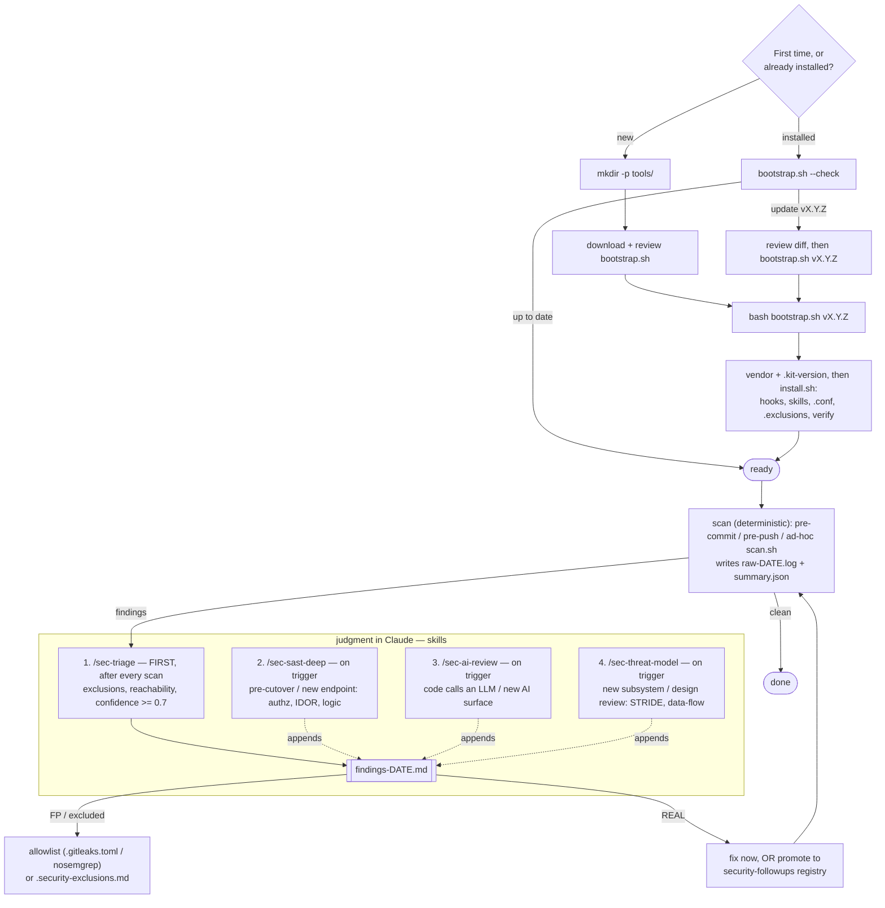

# security-audit-kit — portable local security scanning

[](https://github.com/boraeresici/security-audit-kit/actions/workflows/ci.yml)
[](https://github.com/boraeresici/security-audit-kit/actions/workflows/self-audit.yml)
[](LICENSE)
[](https://github.com/boraeresici/security-audit-kit/releases)

> 🌐 **English:** this file · **Türkçe:** [README-tr.md](README-tr.md)
>
> The **self-audit** badge above is dogfooding: the kit runs its own `secret` + `sast`
> scans on this repo via [`.github/workflows/self-audit.yml`](.github/workflows/self-audit.yml).

A self-contained kit that runs local security scans in **any git repo** without
depending on CI (or its billing), triggers automatically via git hooks, and wires
finding triage into a Claude skill.

Covered dimensions: **secrets** (gitleaks), **SAST** (semgrep), **dependency CVE**
(pip-audit + pnpm/yarn/npm), **IaC misconfig** (checkov), **container/fs** (trivy),
**SBOM** (syft), plus an **optional broad multi-ecosystem dependency CVE** dimension
(`scan.sh osv` — OSV-Scanner, py/js/go/rust/…). Any dimension whose toolchain is missing
is skipped automatically.

On top of these, four Claude skills add a judgment layer: **`sec-triage`** (raw
scan -> real/false-positive decision -> fix/allowlist), **`sec-sast-deep`** (*semantic*
code flaws semgrep's patterns miss: horizontal authz/IDOR, vertical authz/missing-role,
business logic — by following the call path), **`sec-ai-review`** (AI/LLM risks per the
OWASP LLM Top 10: prompt injection, insecure output handling, excessive agency), and
**`sec-threat-model`** (STRIDE + data-flow threat modeling of the attack surface). The
latter three don't run inside `scan.sh` (judgment, not a script); run them in Claude
periodically / before a cutover / after a new endpoint, AI surface, or subsystem.

## Lifecycle (install → update → scan)



Skill order: **`/sec-triage` runs first** after any scan with findings (writes `findings-DATE.md`,
splits FP→allowlist/exclusions vs REAL→fix/follow-up). **`/sec-sast-deep`** and **`/sec-ai-review`**
are deeper, trigger-based passes whose findings append to the *same* file and flow.

Updates are **explicit**: `--check` only reports (read-only, no install); `bootstrap.sh <tag>`
re-vendors and re-runs install. Nothing auto-pulls upstream — pin a tag, review the diff, bump.

## Install (recommended): bootstrap from this repo, pinned

`bootstrap.sh` fetches the kit at a **pinned tag**, vendors it into your project's
`tools/security-audit-kit/`, then runs `install.sh`. Run it from your target repo root:

```bash
# 1) Download the bootstrap script and READ it first (no piping to a shell):
curl -fsSL https://raw.githubusercontent.com/boraeresici/security-audit-kit/main/bootstrap.sh \
  -o bootstrap.sh && less bootstrap.sh
# 2) Run it pinned to a tag:
bash bootstrap.sh v1.0.0
bash bootstrap.sh v1.0.0 --scan          # also run a full scan after install
bash bootstrap.sh v1.0.0 --expect=<sha>  # enforce the pin: refuse if the tag resolved elsewhere
```

> `bootstrap.sh` defaults `KIT_REPO` to this repo. To vendor from a fork, override it:
> `KIT_REPO=https://… bash bootstrap.sh v1.0.0`.

`install.sh` (which bootstrap calls): reports prerequisites -> points `core.hooksPath`
at the kit's hooks folder -> copies the `sec-triage` + `sec-sast-deep` skills into
`.claude/skills/`. Idempotent, safe to re-run.

## Other ways to install

Both land the kit at `tools/security-audit-kit/` in the target repo, then run
`install.sh` from the repo root (the hooks hard-code that path).

**Clone, then copy it in** — air-gapped, or you want to inspect the full repo first:
```bash
git clone https://github.com/boraeresici/security-audit-kit.git
mkdir -p /target/project/tools
cp -R security-audit-kit /target/project/tools/security-audit-kit
cd /target/project && bash tools/security-audit-kit/install.sh
```

**Copy from a project that already has it** — offline, no network; propagate the same
vendored copy laterally to another local repo:
```bash
cp -R /project-a/tools/security-audit-kit /project-b/tools/
cd /project-b && bash tools/security-audit-kit/install.sh
```

## Using the pre-commit framework (alternative to the kit's own hooks)

Already on [pre-commit](https://pre-commit.com)? Add the kit to your `.pre-commit-config.yaml`
instead of using its git hooks:

```yaml
- repo: https://github.com/boraeresici/security-audit-kit
  rev: v1.6.0          # pin a tag
  hooks:
    - id: sec-staged   # every commit: staged-secret scan
    - id: sec-deps     # on a dependency-manifest change: CVE audit
    - id: sec-all      # pre-push / manual: full scan
```
```bash
pre-commit install                         # sec-staged + sec-deps
pre-commit install --hook-type pre-push    # sec-all
```

Use **either** the pre-commit framework **or** the kit's own hooks (`install.sh` / `core.hooksPath`),
not both (`core.hooksPath` would shadow pre-commit). For the Claude skills + config without
touching hooks: `bash tools/security-audit-kit/install.sh --skills-only`.

Why this shape (consistent with the kit's own ethos):
- **No `curl | bash`.** This is a *security* tool — download, review, then run. Piping
  a remote script straight into a shell is the exact anti-pattern the kit warns against.
- **Pinning is required in practice.** A moving ref (`main`) breaks the "no drift vs.
  CI" promise; bootstrap warns if you don't pass a tag/SHA. It writes a `.kit-version`
  (ref + resolved SHA) you can commit so the whole team shares one pinned version. Pass
  `--expect=<sha>` to **enforce** the pin (refuse if the ref resolves elsewhere), and a
  re-vendor of an already-pinned ref that now points to a different commit is refused
  (tag-repoint guard) unless you pass `--allow-ref-change`.
- **Auto-scan is opt-in** (`--scan`), not the default — it respects the kit's split
  between the gate (hooks, deterministic) and judgment (`/sec-triage`, needs Claude).
- **Idempotent.** Re-run `bash tools/security-audit-kit/bootstrap.sh <new-tag>` to
  update to a newer pinned version (overwrites the vendored copy, preserves your
  `.security-audit.conf`).

**Alternative for teams wanting upstream updates:** vendor the kit as a git
`submodule`/`subtree` instead of a bootstrap copy. Heavier (submodule friction);
only worth it if you want `git`-tracked updates from the kit repo.

### Detecting & applying updates

The bootstrap **vendors a copy**, so your project's `git` does not track the kit
repo — it won't tell you upstream changed. Two ways to find out:

1. **`--check` (built in, read-only).** Compares the vendored `.kit-version`
   against the newest semver tag in the kit repo via `git ls-remote` (no clone):
   ```bash
   bash tools/security-audit-kit/bootstrap.sh --check
   # vendored version : v1.0.0
   # latest tag       : v1.1.0
   # !! UPDATE AVAILABLE -> bash tools/security-audit-kit/bootstrap.sh v1.1.0
   ```
   Exit code: `0` = up to date, `1` = update available — so you can wire it into a
   periodic check or a `make` target.
2. **Watch the kit repo's releases** on GitHub (Watch → Custom → Releases) for a push
   notification when a new tag ships.

**Apply the update** (idempotent — overwrites the vendored copy, preserves your
`.security-audit.conf`):
```bash
bash tools/security-audit-kit/bootstrap.sh v1.1.0   # the new pinned tag
git diff -- tools/security-audit-kit                 # review what changed
git add tools/security-audit-kit && git commit -m "chore(sec): bump security-audit-kit to v1.1.0"
```
The committed `.kit-version` (ref + SHA) is the team's shared record of which pinned
version is in use, and what `--check` compares against next time.

## Requirements (a missing one only skips that dimension)
- **docker** — gitleaks / trivy / syft / osv-scanner (pinned images, no install)
- **uvx or pipx** — semgrep / checkov / pip-audit (no install, on-demand)
- **pnpm / yarn / npm** — JS dep audit (whichever the project uses)

You don't need to permanently install any tool. Every version is pinned — Python tools
(semgrep/checkov/pip-audit) by version, docker tools (gitleaks/trivy/syft) by **immutable
digest** — so there is no drift vs. CI. Run `scan.sh doctor` to print the resolved pins.

## Usage

```
bash tools/security-audit-kit/scan.sh all        # full (before a PR)
bash tools/security-audit-kit/scan.sh fast       # staged-secret + deps (after adding a package)
bash tools/security-audit-kit/scan.sh staged     # sub-second secret scan of staged changes
bash tools/security-audit-kit/scan.sh changed    # SAST on changed files only (diff-aware, fast)
bash tools/security-audit-kit/scan.sh secret|sast|deps|iac|container|sbom
bash tools/security-audit-kit/scan.sh osv        # optional: broad multi-ecosystem dep CVE (OSV-Scanner)
bash tools/security-audit-kit/scan.sh doctor     # report toolchain, pins, detected projects
bash tools/security-audit-kit/scan.sh verify     # check kit files against CHECKSUMS (integrity)
```

Every run writes a machine-readable `docs/security/scan-findings/summary.json`. Set
`SARIF=1` to also emit per-tool SARIF (for GitHub code scanning / IDE) into `.../sarif/`.

Automatic triggers (after install):
- **pre-commit** — always a sub-second staged-secret scan (`scan.sh staged`); plus
  `scan.sh deps` when a dependency manifest is staged (both HARD).
- **pre-push** — runs `scan.sh all` (HARD). Right before a PR.
- Bypass (emergency): `SKIP_SECURITY=1 git commit` / `git push --no-verify`.

## Finding loop (end to end)

```
every commit --(pre-commit)-->  scan.sh staged  (+ deps if a manifest changed)
before a PR  --(pre-push)----->  scan.sh all
finding      --> /sec-triage in Claude --> docs/security/scan-findings/findings-YYYY-MM-DD.md
                                           |- FP   -> allowlist (.gitleaks.toml / nosemgrep / .pip-audit-ignore)
                                           |- REAL -> fix OR follow-up registry entry
```

## Deep (semantic) SAST — `/sec-sast-deep`

`scan.sh sast` (semgrep) is **pattern-based**: it catches known bad signatures.
Authorization and business-rule flaws, however, depend on the **intent** in the
code — a matter of the **call path**, not a pattern. The `sec-sast-deep` skill
deep-scans those 3 classes with Claude: horizontal authz/IDOR, vertical
authz/missing-role, business logic. It **complements semgrep, does not replace it**.

- **Does NOT run inside `scan.sh`** (judgment, not a script); run it as
  `/sec-sast-deep` in Claude.
- **When:** before a cutover (phase exit / version bump), after a new authz
  surface (new endpoint/resolver/admin-viewer/4-eyes flow), or on request.
  NOT on every push.
- Output feeds the same `sec-triage` flow (findings file + follow-up registry promotion).
- Independently written; inspired by `github.com/utkusen/sast-skills` (its three-phase
  recon->verify->merge structure), adapted to the kit's triage flow — no code/text copied.

## AI/LLM security review — `/sec-ai-review`

If the codebase **calls an LLM**, exposes **tools/agents**, or does **RAG**, classic SAST
doesn't cover the real risk: untrusted text reaching a powerful sink. `sec-ai-review` is a
semantic skill (like `sec-sast-deep`) mapped to the **OWASP LLM Top 10** — prompt injection
(direct/indirect), insecure output handling, excessive agency, system-prompt/sensitive-info
disclosure, and model/data supply chain. It follows the data/authority flow, not a pattern.

- **Does NOT run inside `scan.sh`**; run it as `/sec-ai-review` in Claude.
- **When:** before shipping a new AI surface (a new tool the model can call, a new data
  source fed into a prompt, a new autonomous agent / MCP server), or on request.
- Output feeds the same `sec-triage` flow.
- Independently written; inspired by `github.com/utkusen/awesome-ai-security` + the OWASP LLM
  Top 10, used as the living checklist (not a tracker) — currency comes from the release cadence.

## Threat modeling — `/sec-threat-model`

Higher-altitude than `sec-sast-deep` (which finds concrete code flaws): `sec-threat-model` maps
the **attack surface and trust boundaries** and asks *what could go wrong by design, and what is
not defended* — using **STRIDE + a data-flow** view. Judgment-only, reusable in any repo.

- **Does NOT run inside `scan.sh`**; run it as `/sec-threat-model` in Claude.
- **When:** a new subsystem / trust boundary, a security design review, before a cutover, or on
  request. NOT per-push.
- **Output:** a living `docs/security/threat-model-<DATE>.md` (data-flow + STRIDE tables); concrete
  gaps are promoted into the same `sec-triage` flow (findings file + follow-up registry).

## When to run which skill (cadence)

| Skill | Cadence | Trigger |
|---|---|---|
| `/sec-triage` | **routine** — after any scan with findings | pre-push block · after adding a package · weekly scan |
| `/sec-sast-deep` | **periodic / milestone** (not every push) | before a cutover, or a new authz surface (endpoint/role/4-eyes) |
| `/sec-ai-review` | **periodic / milestone** (not every push) | a new AI surface (LLM call / tool / agent / RAG / MCP); skip if no LLM |
| `/sec-threat-model` | **periodic / milestone** (not every push) | a new subsystem / trust boundary, or a security design review |

At a release/cutover gate, run cheap → expensive:
`scan.sh all` → `/sec-triage` → `/sec-sast-deep` (if authz surfaces) →
`/sec-ai-review` (if LLM) → consolidate findings → fix/allowlist/follow-up → re-scan clean.
The two deep skills are token-costly judgment passes — trigger-based, not per-push; their
findings append to the same `findings-DATE.md`.

## "When/how do I produce the triage file?" (triggering)

**Scanning does NOT produce a file; triage does.** The split is deliberate:
`findings-*.md` carries the JUDGMENT of "real vs. FP + what was done" — Claude does
that, not a plain script.

The user doesn't have to remember; the trigger announces itself:
1. **At the end of every scan** (make or scan.sh) a fixed instruction is printed to
   the console: `NEXT STEP — for triage, in Claude Code: /sec-triage`.
2. **scan.sh** also writes the raw output to
   `docs/security/scan-findings/raw-<TODAY>.log` — a visible "to-do" trail sitting
   in the folder (gitignored, transient).
3. **Run `/sec-triage` in Claude** (no args): the skill first reads
   `raw-<TODAY>.log` (or runs the scan itself if absent), decides real/FP for each
   finding, writes `findings-<TODAY>.md`, applies FP->allowlist / real->fix.

So: **always Claude** (because judgment is needed), but **when** is clear — until
the scan says "now /sec-triage"; not needed for a clean scan (0 findings). If you
want automation, a hook can call `claude -p "/sec-triage"` headless (spends tokens
on every scan; not recommended for interactive use).

## Configuration (per project)

The kit runs **zero-config** (default `SAST_PATHS=.` whole repo, semgrep skips
node_modules/.git/.venv; `TF_DIR` auto from the first `*.tf`; js/py package manager
auto-detected). For customization, one file per project:

1. On setup, `install.sh` creates **`.security-audit.conf`** at the repo root
   (template: `security-audit.conf.example`).
2. Tune the values for your project and **commit it** (team-shared):
   ```sh
   : "${SAST_PATHS:=backend frontend}"     # narrow source directories
   : "${TF_DIR:=infra/terraform}"          # terraform directory
   : "${SEMGREP_CONFIGS:=--config p/python --config p/react ...}"
   ```
3. `scan.sh` sources it automatically.

**Precedence:** `env > .security-audit.conf > default`. Thanks to the `:=` form,
use env for a one-off override: `SAST_PATHS="lib" bash scan.sh sast`.

Pins live in the same file too: `GITLEAKS_VER` / `TRIVY_VER` / `SYFT_VER`.

### Triage exclusions (signal control)
`install.sh` also creates **`.security-exclusions.md`** (template:
`exclusions.example.md`). The Claude triage skills read it **first** and auto-drop findings
matching a do-not-report class (DoS, test-only files, memory-safe languages, UUID-guessing,
trusted env vars…) or a precedent assumption — then run a **confidence-scored verification
pass** and report only findings ≥ 0.7 (the rest go to a "Suppressed" section, on record). Tune
and commit it per project; it kills recurring false-positive noise deterministically.

## HARD boundary
These tools produce **internal evidence**. They **do not replace** PCI DSS Req
11.3.2 ASV scans or Req 11.4 pentests — those are external-authority / gated. The
kit does not cover those; it only catches problems that have leaked into the code
early.

## Security & trust
Public and [MIT](LICENSE)-licensed, so **anyone can fork and modify it** (including the
skills — they're AI instructions). The **only official repo** is
`github.com/boraeresici/security-audit-kit`; `bootstrap.sh` defaults there, and you must
deliberately override `KIT_REPO` to install from a fork. The kit produces **internal evidence
with no warranty**. Pin a tag/SHA, **review skills before running**, and review diffs on
update. Full trust model, supply-chain guidance, and vulnerability reporting:
[SECURITY.md](SECURITY.md).

## License
[MIT](LICENSE) — developed by [studiobinary.co](https://studiobinary.co).
