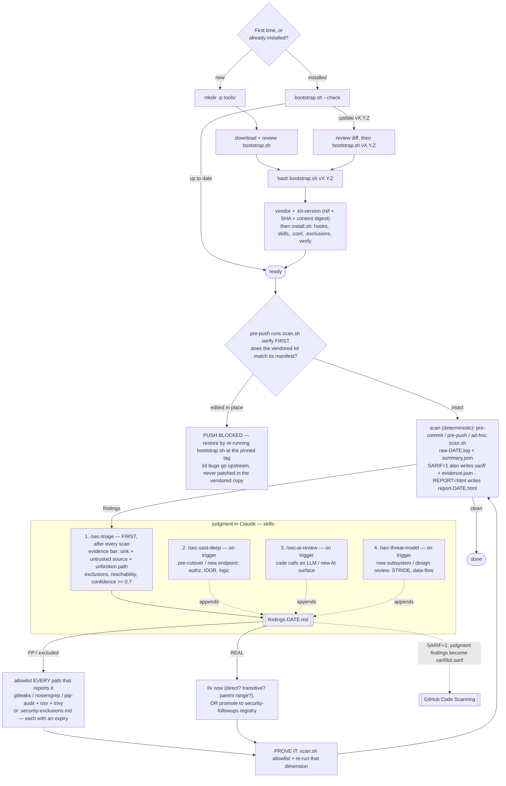

# security-audit-kit — portable local security scanning

[](https://github.com/boraeresici/security-audit-kit/actions/workflows/ci.yml)
[](https://github.com/boraeresici/security-audit-kit/actions/workflows/self-audit.yml)
[](LICENSE)
[](https://github.com/boraeresici/security-audit-kit/releases)

> 🌐 **English:** this file · **Türkçe:** [README-tr.md](README-tr.md)
>
> The **self-audit** badge above is dogfooding: the kit runs its own `secret` + `sast`
> scans on this repo via [`.github/workflows/self-audit.yml`](.github/workflows/self-audit.yml).

A self-contained kit that runs local security scans in **any git repo** without
depending on CI (or its billing), triggers automatically via git hooks, and wires
finding triage into a Claude skill.

Covered dimensions: **secrets** (gitleaks), **SAST** (semgrep), **dependency CVE**
(pip-audit + pnpm/yarn/npm), **IaC misconfig** (checkov), **container/fs** (trivy),
**SBOM** (syft), plus optional dimensions: **broad multi-ecosystem dependency CVE**
(`scan.sh osv` — OSV-Scanner, py/js/go/rust/…), **malicious/typosquat dependencies**
(`scan.sh guarddog` — GuardDog; the known-CVE blind spot), and **GitHub Actions security**
(`scan.sh zizmor` — template injection, poisoned pipelines, token over-permissioning), plus a
**pre-install package check** (`scan.sh pkgcheck` — guarddog on a package *before* `npm i` runs its
install script; also available as an agent hook). Any
dimension whose toolchain is missing is skipped automatically.

On top of these, four Claude skills add a judgment layer: **`sec-triage`** (raw
scan -> real/false-positive decision -> fix/allowlist, at a **hard-evidence bar**: calling a
finding REAL requires naming the sink `file:line`, the untrusted source and an unbroken path —
the default verdict is FP), **`sec-sast-deep`** (*semantic*
code flaws semgrep's patterns miss: horizontal authz/IDOR, vertical authz/missing-role,
business logic, semantic/stack-specific injection — by following the call path), **`sec-ai-review`** (AI/LLM risks per the
OWASP LLM Top 10: prompt injection, insecure output handling, excessive agency), and
**`sec-threat-model`** (STRIDE + data-flow threat modeling of the attack surface). The
latter three don't run inside `scan.sh` (judgment, not a script); run them in Claude
periodically / before a cutover / after a new endpoint, AI surface, or subsystem.

Don't want to pick? **`sec-audit`** is a one-command orchestrator: it runs the scan + triage
and the deep passes that *actually apply* to the repo (signal-gated, not blindly), and
consolidates everything into one findings file.

## Lifecycle (install → update → scan)


```mermaid
flowchart TD
    Q{First time, or<br/>already installed?}
    Q -->|new| N1["mkdir -p tools/"]
    N1 --> N2["download + review bootstrap.sh"]
    N2 --> B["bash bootstrap.sh vX.Y.Z"]
    Q -->|installed| C["bootstrap.sh --check"]
    C -->|up to date| R
    C -->|update vX.Y.Z| RV["review diff, then bootstrap.sh vX.Y.Z"]
    RV --> B
    B --> I["vendor + .kit-version (ref + SHA + content digest)<br/>then install.sh: hooks, skills, .conf, .exclusions, verify"]
    I --> R(["ready"])

    R --> V{"pre-push runs scan.sh verify FIRST<br/>does the vendored kit match its manifest?"}
    V -->|"edited in place"| VX["PUSH BLOCKED — restore by re-running bootstrap.sh at the pinned tag<br/>kit bugs go upstream, never patched in the vendored copy"]
    V -->|intact| S["scan (deterministic): pre-commit / pre-push / ad-hoc scan.sh<br/>raw-DATE.log + summary.json<br/>SARIF=1 also writes sarif/ + evidence.json · REPORT=html writes report-DATE.html"]
    S -->|clean| D(["done"])
    S -->|findings| T1

    subgraph JUDGE["judgment in Claude — skills"]
      direction TB
      T1["1. /sec-triage — FIRST, after every scan<br/>evidence bar: sink + untrusted source + unbroken path<br/>exclusions, reachability, confidence >= 0.7"]
      DEEP["2. /sec-sast-deep — on trigger<br/>pre-cutover / new endpoint: authz, IDOR, logic"]
      AIR["3. /sec-ai-review — on trigger<br/>code calls an LLM / new AI surface"]
      TM["4. /sec-threat-model — on trigger<br/>new subsystem / design review: STRIDE, data-flow"]
      T1 --> F[["findings-DATE.md"]]
      DEEP -. appends .-> F
      AIR -. appends .-> F
      TM -. appends .-> F
    end

    F -->|FP / excluded| AL["allowlist EVERY path that reports it<br/>gitleaks / nosemgrep / pip-audit + osv + trivy<br/>or .security-exclusions.md — each with an expiry"]
    F -->|REAL| FX["fix now (direct? transitive? parent range?),<br/>OR promote to security-followups registry"]
    AL --> P["PROVE IT: scan.sh allowlist + re-run that dimension"]
    FX --> P
    P --> S
    F -. "SARIF=1: judgment findings become sarif/kit.sarif" .-> CS[["GitHub Code Scanning"]]
```

Skill order: **`/sec-triage` runs first** after any scan with findings (writes `findings-DATE.md`,
splits FP→allowlist/exclusions vs REAL→fix/follow-up). **`/sec-sast-deep`** and **`/sec-ai-review`**
are deeper, trigger-based passes whose findings append to the *same* file and flow.

Updates are **explicit**: `--check` only reports (read-only, no install); `bootstrap.sh <tag>`
re-vendors and re-runs install. Nothing auto-pulls upstream — pin a tag, review the diff, bump.

## Install (recommended): bootstrap from this repo, pinned

`bootstrap.sh` fetches the kit at a **pinned tag**, vendors it into your project's
`tools/security-audit-kit/`, then runs `install.sh`. Run it from your target repo root:

```bash
# 1) Download the bootstrap script and READ it first (no piping to a shell):
curl -fsSL https://raw.githubusercontent.com/boraeresici/security-audit-kit/main/bootstrap.sh \
  -o bootstrap.sh && less bootstrap.sh
# 2) Run it pinned to a tag:
bash bootstrap.sh v1.17.0
bash bootstrap.sh v1.17.0 --scan          # also run a full scan after install
bash bootstrap.sh v1.17.0 --expect=<sha>  # enforce the pin: refuse if the tag resolved elsewhere
```

> `bootstrap.sh` defaults `KIT_REPO` to this repo. To vendor from a fork, override it:
> `KIT_REPO=https://… bash bootstrap.sh v1.17.0`.

`install.sh` (which bootstrap calls): reports prerequisites -> points `core.hooksPath`
at the kit's hooks folder -> copies the `sec-triage` + `sec-sast-deep` skills into
`.claude/skills/`. Idempotent, safe to re-run.

## Other ways to install

Both land the kit at `tools/security-audit-kit/` in the target repo, then run
`install.sh` from the repo root (the hooks hard-code that path).

**Clone, then copy it in** — air-gapped, or you want to inspect the full repo first:
```bash
git clone https://github.com/boraeresici/security-audit-kit.git
mkdir -p /target/project/tools
cp -R security-audit-kit /target/project/tools/security-audit-kit
cd /target/project && bash tools/security-audit-kit/install.sh
```

**Copy from a project that already has it** — offline, no network; propagate the same
vendored copy laterally to another local repo:
```bash
cp -R /project-a/tools/security-audit-kit /project-b/tools/
cd /project-b && bash tools/security-audit-kit/install.sh
```

## After install: making the skills visible in Claude Code

The five `sec-*` skills are plain files at `<repo-root>/.claude/skills/<name>/SKILL.md`.
Claude Code reads them off disk, so **you do not need to commit anything to see them**.
Two things decide whether they show up:

1. **Claude Code's working root must BE the repo root** that holds `.claude/skills`. Only
   `<root>/.claude/skills` is scanned — subdirectories are not, and `--add-dir` does not
   extend the scan. If you keep several repos side by side under a container folder and
   open the **container** in your editor, skills installed into one of the repos will not
   load:

   ```
   work/acme/                 <- opening THIS in the editor: no skills
     backend/                 <- opening THIS: skills load
       tools/security-audit-kit/
       .claude/skills/sec-*/
     frontend/                <- needs its own install
   ```

2. **Start a new session.** Skills are enumerated at session start; toggling them in
   `/skills` mid-session does not discover newly installed ones.

Confirm with `/skills` — `sec-audit`, `sec-triage`, `sec-sast-deep`, `sec-ai-review` and
`sec-threat-model` should all be listed.

**Committing is for your teammates, not for you.** The skills reach the rest of the team
the way any other file does, through git:

```bash
git add .claude/skills tools/security-audit-kit .security-audit.conf .security-exclusions.md
git commit -m "chore(sec): add security-audit-kit"
```

**One install per repository.** The kit is repo-scoped by design: hooks are wired through
that repo's `core.hooksPath`, `.security-audit.conf` carries that repo's SAST paths, and
findings land in that repo's `docs/security/scan-findings/`. A backend and a frontend in
two repos need two installs — there is no cross-repo mode.

## Using the pre-commit framework (alternative to the kit's own hooks)

Already on [pre-commit](https://pre-commit.com)? Add the kit to your `.pre-commit-config.yaml`
instead of using its git hooks:

```yaml
- repo: https://github.com/boraeresici/security-audit-kit
  rev: v1.17.0          # pin a tag
  hooks:
    - id: sec-staged   # every commit: staged-secret scan
    - id: sec-deps     # on a dependency-manifest change: CVE audit
    - id: sec-all      # pre-push / manual: full scan
```
```bash
pre-commit install                         # sec-staged + sec-deps
pre-commit install --hook-type pre-push    # sec-all
```

Use **either** the pre-commit framework **or** the kit's own hooks (`install.sh` / `core.hooksPath`),
not both (`core.hooksPath` would shadow pre-commit). For the Claude skills + config without
touching hooks: `bash tools/security-audit-kit/install.sh --skills-only`.

Why this shape (consistent with the kit's own ethos):
- **No `curl | bash`.** This is a *security* tool — download, review, then run. Piping
  a remote script straight into a shell is the exact anti-pattern the kit warns against.
- **Pinning is required in practice.** A moving ref (`main`) breaks the "no drift vs.
  CI" promise; bootstrap warns if you don't pass a tag/SHA. It writes a `.kit-version`
  (ref + resolved SHA) you can commit so the whole team shares one pinned version. Pass
  `--expect=<sha>` to **enforce** the pin (refuse if the ref resolves elsewhere), and a
  re-vendor of an already-pinned ref that now points to a different commit is refused
  (tag-repoint guard) unless you pass `--allow-ref-change`.
- **Auto-scan is opt-in** (`--scan`), not the default — it respects the kit's split
  between the gate (hooks, deterministic) and judgment (`/sec-triage`, needs Claude).
- **Idempotent.** Re-run `bash tools/security-audit-kit/bootstrap.sh <new-tag>` to
  update to a newer pinned version (overwrites the vendored copy, preserves your
  `.security-audit.conf`).

**Alternative for teams wanting upstream updates:** vendor the kit as a git
`submodule`/`subtree` instead of a bootstrap copy. Heavier (submodule friction);
only worth it if you want `git`-tracked updates from the kit repo.

### Detecting & applying updates

The bootstrap **vendors a copy**, so your project's `git` does not track the kit
repo — it won't tell you upstream changed. Two ways to find out:

1. **`--check` (built in, read-only).** Compares the vendored `.kit-version`
   against the newest semver tag in the kit repo via `git ls-remote` (no clone):
   ```bash
   bash tools/security-audit-kit/bootstrap.sh --check
   # vendored version : v1.16.0
   # latest tag       : v1.17.0
   # !! UPDATE AVAILABLE -> bash tools/security-audit-kit/bootstrap.sh v1.17.0
   ```
   Exit code: `0` = up to date, `1` = update available — so you can wire it into a
   periodic check or a `make` target.
2. **Watch the kit repo's releases** on GitHub (Watch → Custom → Releases) for a push
   notification when a new tag ships.

**Apply the update** (idempotent — overwrites the vendored copy, preserves your
`.security-audit.conf`):
```bash
bash tools/security-audit-kit/bootstrap.sh v1.17.0   # the new pinned tag
git diff -- tools/security-audit-kit                 # review what changed
git add tools/security-audit-kit && git commit -m "chore(sec): bump security-audit-kit to v1.17.0"
```
The committed `.kit-version` (ref + SHA + a content digest) is the team's shared record of which
pinned version is in use, and what `--check` compares against next time. The third field binds the
pin to the files: `scan.sh verify` recomputes it and **fails if the pin claims a release the
vendored files aren't** — the case where an untracked `.kit-version` outlives a checkout that
reverted the vendored tree, leaving the team convinced they run a version they don't. A pin written
by an older bootstrap has no digest; verify then falls back to comparing the tag against the
vendored `CHANGELOG`. Re-run `bootstrap.sh <tag> --expect=<sha>` to resolve a mismatch.

### Reachability for dependency CVEs (opt-in)

`OSV_CALL_ANALYSIS=go bash scan.sh osv` asks osv-scanner whether the vulnerable symbol is actually
**called** in your code. Two rules make it safe to turn on:

- **The gate does not loosen.** With call analysis on, osv-scanner drops uncalled vulnerabilities by
  default; the kit always pairs it with `--all-vulns`, so the finding set and the exit code are
  unchanged. What you gain is a *called / uncalled* signal for triage — not fewer findings.
- **No build scripts.** Rust call analysis works by running the dependency tree's build scripts. A
  scanner that executes untrusted code to decide what to report is an own-goal, so it is **refused**
  unless you explicitly accept it with `OSV_ALLOW_BUILD_SCRIPTS=1`.

Go is the ecosystem osv-scanner supports without executing anything. Python and JS reachability
needs a heavier tool (`dep-scan`) and is not shipped — an "uncalled" marking is also not proof:
call graphs miss reflection, dynamic dispatch and plugin loading, so `sec-triage` treats it as a
heavy thumb on the scale, never a verdict.

## Platform notes (Windows: use WSL2)

The kit is bash-first. Linux and macOS are native; on Windows the supported path is **WSL2**.

| Environment | Status | Notes |
|---|---|---|
| Linux | ✓ full | native |
| macOS | ✓ full | native (bash 3.2 — the scripts stay POSIX-ish on purpose) |
| **WSL2** | ✓ full | run everything *inside* the WSL filesystem; docker dimensions work through Docker Desktop's WSL integration |
| Git Bash / MSYS | Partial | `uvx`/`pipx` dimensions and the git hooks work; **docker** dimensions (secret, container, sbom, osv) are unreliable — MSYS rewrites the `/repo` mount into a Windows path before docker sees it. Prefix `MSYS_NO_PATHCONV=1`, or move to WSL2 |
| PowerShell / cmd | ✗ | not supported — no bash |

`scan.sh doctor` prints which of these it is running under, so a mangled mount is named rather than
debugged. Two WSL2 habits that matter:

- **Keep the repo on the Linux side** (`~/code/...`, not `/mnt/c/...`). Scanning across the
  `/mnt/c` bridge is slow enough to change behaviour — gitleaks over a large history goes from
  seconds to minutes.
- **Enable Docker Desktop's WSL integration** for your distro, otherwise `docker info` fails inside
  WSL and the kit skips those dimensions with a notice (the missing-toolchain contract, working as
  intended — but you will be scanning less than you think).

> **Not yet verified by us on a real WSL2 machine.** The path above follows from how the scripts
> work, and `doctor` will tell you what it detected; if you run it under WSL2 or Git Bash, the
> result is worth reporting back.

## Requirements (a missing one only skips that dimension)
- **docker** — gitleaks / trivy / syft / osv-scanner (pinned images, no install)
- **uvx or pipx** — semgrep / checkov / pip-audit / guarddog / zizmor (no install, on-demand)
- **pnpm / yarn / npm** — JS dep audit (whichever the project uses)
- **python3** *(optional)* — `evidence.json`, `kit.sarif` and the HTML report; stdlib only, no
  packages to install. Without it the scan runs exactly as before, minus those artifacts.

You don't need to permanently install any tool. Every version is pinned — Python tools
(semgrep/checkov/pip-audit) by version, docker tools (gitleaks/trivy/syft) by **immutable
digest** — so there is no drift vs. CI. Run `scan.sh doctor` to print the resolved pins.

## Usage

```
bash tools/security-audit-kit/scan.sh all        # full (before a PR)
bash tools/security-audit-kit/scan.sh fast       # staged-secret + deps (after adding a package)
bash tools/security-audit-kit/scan.sh staged     # sub-second secret scan of staged changes
bash tools/security-audit-kit/scan.sh changed    # SAST on changed files only (diff-aware, fast)
bash tools/security-audit-kit/scan.sh secret|sast|deps|iac|container|sbom
bash tools/security-audit-kit/scan.sh osv        # optional: broad multi-ecosystem dep CVE (OSV-Scanner)
bash tools/security-audit-kit/scan.sh guarddog   # optional: malicious/typosquat deps (GuardDog; needs network)
bash tools/security-audit-kit/scan.sh zizmor     # optional: GitHub Actions security (zizmor; offline)
bash tools/security-audit-kit/scan.sh pkgcheck npm lodash    # optional: check ONE package BEFORE installing it
bash tools/security-audit-kit/scan.sh doctor     # report toolchain, pins, detected projects
bash tools/security-audit-kit/scan.sh verify     # check kit files against CHECKSUMS (integrity)
bash tools/security-audit-kit/scan.sh evidence   # rebuild evidence.json from the SARIF on disk
bash tools/security-audit-kit/scan.sh report     # render one self-contained HTML report
```

Every run writes a machine-readable `docs/security/scan-findings/summary.json` (did the scan pass,
per dimension). Set `SARIF=1` to also emit per-tool SARIF (for GitHub code scanning / IDE) into
`.../sarif/` — and, alongside it, **`evidence.json`**: every finding from every dimension in **one
shape**, with severity normalized to `critical|high|medium|low|info` and the tool's own value kept
verbatim next to it. It exists because the tools disagree: osv-scanner labels a CVSS 9.1 advisory
`warning`, semgrep says `ERROR`, gitleaks has no severity at all — so "sort by how bad it is" is
impossible over raw output. Fields, per-tool mapping tables and the guarantees (deterministic and
diffable, deduplicated, repo-relative paths, never invents a score) are specified in
[docs/schema/evidence.md](docs/schema/evidence.md). Needs `python3`; without it the step is skipped,
never failed.

Once a judgment pass has written `findings-<date>.md`, the same step folds those decisions in and
emits **`sarif/kit.sarif`** — the skills' own findings (an IDOR traced through the call path, a
prompt-injection sink) as SARIF 2.1.0, so they reach GitHub Code Scanning like any scanner alert.
Scanner findings are not re-reported (their own SARIF already covers them); suppressed findings are
emitted *as suppressed*, with the triage reason, rather than vanishing. The existing self-audit
workflow uploads the whole `sarif/` directory, so nothing needs wiring.

For a human audience, `REPORT=html` (or `scan.sh report`) renders the same record as **one
self-contained `report-<date>.html`** — no server, no JS, no external fetch, so it opens offline and
prints straight to PDF. It shows what SARIF can't: the triage decision on each scanner finding, and
the suppressed ones on record.

Automatic triggers (after install):
- **pre-commit** — always a sub-second staged-secret scan (`scan.sh staged`); plus
  `scan.sh deps` when a dependency manifest is staged (both HARD).
- **pre-push** — runs `scan.sh verify` (integrity, sub-second) and then `scan.sh all` (both HARD).
  Right before a PR. Verify runs first because a scan is only worth its exit code if the kit that
  produced it is the one you pinned.
- Bypass (emergency): `SKIP_SECURITY=1 git commit` / `git push --no-verify`.

> **The vendored kit is read-only.** Don't hand-edit `tools/security-audit-kit/` — not you, not a
> teammate, not an AI assistant "fixing" the scanner mid-triage. The edit is lost on the next
> `bootstrap.sh`, and until then pre-push blocks for everyone. Found a real bug? Report it upstream
> and bump the pin. The kit's own skills carry this as a hard rule.

## The install-time window — `scan.sh pkgcheck` and the agent hook

Every other dependency dimension reads a manifest that is **already in the repo**. That is one step
too late for a malicious package: `npm i <pkg>` and `pip install <pkg>` run the package's install
script the moment they resolve it, and the kit's pre-commit hook only sees the changed manifest
afterwards. Git hooks cannot see an install; an agent tool-call hook can.

```bash
bash tools/security-audit-kit/scan.sh pkgcheck npm lodash react@18.2.0   # ad-hoc, any time
bash tools/security-audit-kit/install.sh --with-agent-hook               # opt-in: wire it to the agent
```

`--with-agent-hook` adds a `PreToolUse` hook for the `Bash` tool to `.claude/settings.json` (idempotent;
it never rewrites anything else). Before the agent runs an install command, the hook takes the package
names off that command line and asks guarddog about them — while nothing has executed. A flagged
package blocks the tool call; the agent is told what fired and told not to retry.

**What it blocks, and why the list is short.** guarddog reports two different things under one
count: `capability-*` rules (what a package *can* do — `requests` fires three) and `threat-*`/metadata
rules (what looks wrong). Neither maps cleanly to "block". Measured on 2026-08-24 against the 18
most-installed pypi/npm packages, **15 distinct non-capability rules fired on 8 of them** — including
`threat-process-download-exec` on pandas and setuptools, and `metadata_mismatch` on typescript. A gate
that refuses `pip install django` gets uninstalled, and an uninstalled gate protects nothing. So the
kit blocks on an explicit list of ~24 malice-specific rules (typosquatting, dependency confusion,
install-time network access, reverse shells, exfiltration, cryptomining, keylogging, maintainer-domain
takeover) — every one of which fired on **none** of those 18 packages. Everything else is printed as a
note and allowed. Tune with `PKGCHECK_BLOCK_EXTRA` / `PKGCHECK_REPORT_EXTRA` in `.security-audit.conf`.

**What it does not do, stated plainly:**
- It guards the **agent's** tool calls. A human typing `npm i` in a terminal is not covered — nothing
  in a hook can see that.
- Anything it cannot inspect is **allowed, loudly**: no network, no `uvx`/`pipx`, a VCS or local-path
  install, a package the registry 404s. guarddog itself prints *"No risks found"* when the download
  failed, so the kit treats a failed download as `INDETERMINATE` — never as clean.
- It is not a CVE check. `pkgcheck` asks "is this package malicious?"; `deps`/`osv` ask "does it have
  known vulnerabilities?" Both, or neither.
- First check of a package costs ~15-20s (guarddog downloads and analyses it). Verdicts are cached in
  `.git/security-audit-cache/` keyed by package, version **and the pinned guarddog version**; an exact
  `pkg@version` verdict never expires, an unversioned one expires after a day. `scan.sh doctor` prints
  whether the hook is wired, where the cache is, and how many rules block.

## Finding loop (end to end)

```
every commit --(pre-commit)-->  scan.sh staged  (+ deps if a manifest changed)
before a PR  --(pre-push)----->  scan.sh verify   (integrity: an edited vendored kit blocks the push)
                            \-->  scan.sh all
finding      --> /sec-triage in Claude --> docs/security/scan-findings/findings-YYYY-MM-DD.md
                                           |- FP   -> allowlist EVERY reporting path
                                           |          (.gitleaks.toml / nosemgrep /
                                           |           .pip-audit-ignore + osv-scanner.toml + .trivyignore.yaml)
                                           |          + an expiry on each entry
                                           |- REAL -> fix OR follow-up registry entry
                                           v
                                          PROVE IT: scan.sh allowlist  (expired? cross-path gap?)
                                                    re-run that dimension until clean
                                          an unrun suppression, like an unrun fix, is a hypothesis
```

## Your own rules — `semgrep-rules/` + a `.gitleaks.toml` entry

The kit runs registry packs, which know nothing about *your* invariants: every ORM lookup must be
tenant-scoped, this field type is banned, that helper must never be called from a request handler.
Semgrep is very good at exactly this, so the kit gives the mechanism a supported entry point. **The
kit owns the mechanism, you own the rules** — nothing project-specific ships here.

Drop rules in **`semgrep-rules/`** at the repo root (`.semgrep/`, `.semgrep.yml`, `.semgrep.yaml`
also work). They are **appended** to whatever the base is — registry packs stay:

```
semgrep cfg --config p/owasp-top-ten --config p/secrets --config p/javascript --config semgrep-rules (stack-auto + local)
```

That composition is the point. Before, the only way to reach a hand-written rule was to set
`SEMGREP_CONFIGS`, which **replaces** the list — you gained one rule and silently lost OWASP, secrets
and every stack pack, and that frozen list then rotted as the stack grew. Now `SEMGREP_CONFIGS` sets
only the *base*; local rules are added on top of it either way, and `doctor` tells you which packs a
frozen override is now missing.

A rule and its test, side by side:

```yaml
# semgrep-rules/tenant-scope.yaml
rules:
  - id: unscoped-tenant-lookup
    pattern: Model.objects.get(id=$X)
    message: ORM lookup without a tenant filter — cross-tenant read
    severity: ERROR          # <- ERROR or it will NOT gate (see below)
    languages: [python]
```
```python
# semgrep-rules/tenant-scope.py
# ruleid: unscoped-tenant-lookup
Model.objects.get(id=order_id)
# ok: unscoped-tenant-lookup
Model.objects.filter(id=order_id, tenant=current_tenant)
```

Then `scan.sh rules-test` runs semgrep's own test runner over them. A custom rule is code: after a
refactor the pattern quietly stops matching and the gate goes silent, so an untested rule decays
without ever failing.

**Two traps `doctor` now surfaces for you:**

```
local semgrep rules (yours, not shipped by the kit):
  ok  semgrep-rules — 2 rule(s), 1 gating
  !!  1 rule(s) NOT at ERROR -> WILL NOT GATE: bare-except-pass
  ok  rule tests present -> verify with: scan.sh rules-test
```

- `scan.sh sast` runs `--severity ERROR`, so a rule written at `WARNING`/`INFO` **loads and is then
  ignored** — the rule exists, it just never fails anything. There is deliberately no "advisory"
  tier: a gate that does not gate is the hole this feature closes.
- Rules with no tests are called out, because that is how a rule dies quietly.

Turn it all off with `SEMGREP_LOCAL_RULES=off`; point it elsewhere with `SEMGREP_LOCAL_RULES=<paths>`.
Discovery is anchored at those literal paths — it never searches the tree, so a vendored copy of the
kit can never contribute rules to your config, and a rule's own test fixture never counts as part of
your stack.

**Secrets, same idea.** `.gitleaks.toml` is already wired in; gitleaks' entropy rules miss a flat
`PASSWORD=hunter2`, so add the rule you actually want:

```toml
# .gitleaks.toml
[extend]
useDefault = true

[[rules]]
id = "plaintext-password-assignment"
description = "Plaintext password assigned in config or code"
regex = '''(?i)\b(password|passwd|pwd)\s*[:=]\s*['"]?[^\s'"$#{}]{6,}'''
[rules.allowlist]
regexes = ['''(?i)(example|dummy|changeme|placeholder|\$\{|process\.env|os\.getenv)''']
```

### Suppressing a finding: cover every path that reports it

An allowlist is per **tool**; a triage decision is about a **finding** — and several dimensions
overlap by design. A dependency CVE is read out of the same lockfile by **pip-audit, osv-scanner and
trivy**, which report it under different ids (`PYSEC-…`, `CVE-…`, `GHSA-…` are aliases of one
advisory). Silence it in one place and it returns as an unresolved HIGH from another — and with
`SARIF=1` it reaches Code Scanning carrying no trace of the decision, because `kit.sarif` cannot
dismiss another tool's run.

| Finding | Reported by | Suppression goes in |
|---|---|---|
| secret | `secret`, `staged` | `# gitleaks:allow` on the line, or a narrow `.gitleaks.toml` rule |
| SAST | `sast`, `changed` | `# nosemgrep: <rule-id>` + rationale |
| **dependency CVE** | **`py-deps` + `osv` + `container`** | **`.pip-audit-ignore` + `osv-scanner.toml` + `.trivyignore.yaml`** |
| IaC | `iac` | `#checkov:skip=<CHECK_ID>:<reason>` |
| CI workflow | `zizmor` | `# zizmor: ignore[<rule>]` |
| recurring *judgment* FP | the AI layer | `.security-exclusions.md` |

`scan.sh allowlist` audits them — offline, no scan. It names **expired** deferrals with their date,
counts entries carrying **no expiry at all** (those never become loud again), and flags an advisory
suppressed in one dependency path but **absent from another**; it exits non-zero on either. Its
honest limit: the cross-path check compares **exact ids**, so alias pairs (`PYSEC-…` / `CVE-…` /
`GHSA-…` of one advisory) are not matched — silence means "no gap found", never "you are covered".
`doctor` carries the one-line verdict.

```
== allowlist audit (2026-08-23) ==
  !!  .pip-audit-ignore      EXPIRED GHSA-aaaa-bbbb-cccc (2026-07-01) — the deferral outlived its date
  ok  .pip-audit-ignore      3 entr(y|ies) · 1 expired · 1 with no expiry
  !!  GHSA-aaaa-bbbb-cccc is suppressed in .pip-audit-ignore but not in osv-scanner.toml
```

`scan.sh doctor` lists which of these files exist in your repo, so a half-applied suppression is
visible. Two habits keep it honest: **re-run the affected dimensions** after writing the entries (a
suppression you did not re-run is a hypothesis), and **give every deferral an expiry** —
`ignoreUntil` in `osv-scanner.toml`, an `# expires YYYY-MM-DD — fixed in <ver>` comment elsewhere.
Hand-synced allowlists decay: when the fix lands the entry must go from *all* of them, and a
forgotten one silently suppresses a future, real CVE in that package.

## Deep (semantic) SAST — `/sec-sast-deep`

`scan.sh sast` (semgrep) is **pattern-based**: it catches known bad signatures.
Authorization and business-rule flaws, however, depend on the **intent** in the
code — a matter of the **call path**, not a pattern. The `sec-sast-deep` skill
deep-scans those 4 classes with Claude: horizontal authz/IDOR, vertical
authz/missing-role, business logic, and semantic/stack-specific injection
(second-order, wrapper-hidden, ORM/SSTI/NoSQL idioms semgrep misses across the
call path). It **complements semgrep, does not replace it**.

- **Does NOT run inside `scan.sh`** (judgment, not a script); run it as
  `/sec-sast-deep` in Claude.
- **When:** before a cutover (phase exit / version bump), after a new authz
  surface (new endpoint/resolver/admin-viewer/4-eyes flow), or on request.
  NOT on every push.
- Output feeds the same `sec-triage` flow (findings file + follow-up registry promotion).
- Independently written; inspired by `github.com/utkusen/sast-skills` (its three-phase
  recon->verify->merge structure), adapted to the kit's triage flow — no code/text copied.

## AI/LLM security review — `/sec-ai-review`

If the codebase **calls an LLM**, exposes **tools/agents**, or does **RAG**, classic SAST
doesn't cover the real risk: untrusted text reaching a powerful sink. `sec-ai-review` is a
semantic skill (like `sec-sast-deep`) mapped to the **OWASP LLM Top 10** — prompt injection
(direct/indirect), insecure output handling, excessive agency, system-prompt/sensitive-info
disclosure, and model/data supply chain. It follows the data/authority flow, not a pattern.

- **Does NOT run inside `scan.sh`**; run it as `/sec-ai-review` in Claude.
- **When:** before shipping a new AI surface (a new tool the model can call, a new data
  source fed into a prompt, a new autonomous agent / MCP server), or on request.
- Output feeds the same `sec-triage` flow.
- Independently written; inspired by `github.com/utkusen/awesome-ai-security` + the OWASP LLM
  Top 10, used as the living checklist (not a tracker) — currency comes from the release cadence.

## Threat modeling — `/sec-threat-model`

Higher-altitude than `sec-sast-deep` (which finds concrete code flaws): `sec-threat-model` maps
the **attack surface and trust boundaries** and asks *what could go wrong by design, and what is
not defended* — using **STRIDE + a data-flow** view. Judgment-only, reusable in any repo.

- **Does NOT run inside `scan.sh`**; run it as `/sec-threat-model` in Claude.
- **When:** a new subsystem / trust boundary, a security design review, before a cutover, or on
  request. NOT per-push.
- **Output:** a living `docs/security/threat-model-<DATE>.md` (data-flow + STRIDE tables); concrete
  gaps are promoted into the same `sec-triage` flow (findings file + follow-up registry).

## One command — `/sec-audit`

Prefer not to choose? `/sec-audit` is the orchestrator entry point: it runs `scan.sh all`,
triages (exclusions → reachability → confidence), then runs **only the deep passes the repo
calls for** — `sec-sast-deep` if there are authz surfaces, `sec-ai-review` if the code calls an
LLM, `sec-threat-model` for a new subsystem (or all on `deep`). It announces *which* deep pass
it runs and *why* before spending the tokens, and writes one consolidated `findings-<DATE>.md`.

## When to run which skill (cadence)

| Skill | Cadence | Trigger |
|---|---|---|
| `/sec-audit` | **anytime** — the one-command entry point | "audit this repo" / before a PR; runs the right things for you |
| `/sec-triage` | **routine** — after any scan with findings | pre-push block · after adding a package · weekly scan |
| `/sec-sast-deep` | **periodic / milestone** (not every push) | before a cutover, or a new authz surface (endpoint/role/4-eyes) |
| `/sec-ai-review` | **periodic / milestone** (not every push) | a new AI surface (LLM call / tool / agent / RAG / MCP); skip if no LLM |
| `/sec-threat-model` | **periodic / milestone** (not every push) | a new subsystem / trust boundary, or a security design review |

At a release/cutover gate, run cheap → expensive:
`scan.sh all` → `/sec-triage` → `/sec-sast-deep` (if authz surfaces) →
`/sec-ai-review` (if LLM) → consolidate findings → fix/allowlist/follow-up → re-scan clean.
The two deep skills are token-costly judgment passes — trigger-based, not per-push; their
findings append to the same `findings-DATE.md`.

## "When/how do I produce the triage file?" (triggering)

**Scanning does NOT produce a file; triage does.** The split is deliberate:
`findings-*.md` carries the JUDGMENT of "real vs. FP + what was done" — Claude does
that, not a plain script.

The user doesn't have to remember; the trigger announces itself:
1. **At the end of every scan** (make or scan.sh) a fixed instruction is printed to
   the console: `NEXT STEP — for triage, in Claude Code: /sec-triage`.
2. **scan.sh** also writes the raw output to
   `docs/security/scan-findings/raw-<TODAY>.log` — a visible "to-do" trail sitting
   in the folder (gitignored, transient).
3. **Run `/sec-triage` in Claude** (no args): the skill first reads
   `raw-<TODAY>.log` (or runs the scan itself if absent), decides real/FP for each
   finding, writes `findings-<TODAY>.md`, applies FP->allowlist / real->fix.

So: **always Claude** (because judgment is needed), but **when** is clear — until
the scan says "now /sec-triage"; not needed for a clean scan (0 findings). If you
want automation, a hook can call `claude -p "/sec-triage"` headless (spends tokens
on every scan; not recommended for interactive use).

## Configuration (per project)

The kit runs **zero-config** (default `SAST_PATHS=.` whole repo, semgrep skips
node_modules/.git/.venv; `TF_DIR` auto from the first `*.tf`; js/py package manager
auto-detected). **Semgrep rulesets are stack-aware**: with `SEMGREP_CONFIGS` unset, `scan.sh`
auto-selects packs from what's in the repo — base `p/owasp-top-ten` + `p/secrets`, plus the
detected language/framework packs (`p/python`/`p/django`, `p/javascript`/`p/typescript`/`p/react`,
`p/golang`, `p/java`, `p/php`, `p/ruby`, `p/csharp`) — so each project gets its own injection
rules. `scan.sh doctor` prints the resolved set. For customization, one file per project:

1. On setup, `install.sh` creates **`.security-audit.conf`** at the repo root
   (template: `security-audit.conf.example`).
2. Tune the values for your project and **commit it** (team-shared):
   ```sh
   : "${SAST_PATHS:=backend frontend}"     # narrow source directories
   : "${TF_DIR:=infra/terraform}"          # terraform directory
   # : "${JS_DIRS:=frontend}"              # js-deps: where the JS app is (see below)
   # : "${SEMGREP_CONFIGS:=--config p/python --config p/react ...}"  # leave unset = stack-auto; set to override
   ```
3. `scan.sh` sources it automatically.

**`js-deps` picks its directory by lockfile, not by luck.** Every tracked `package.json` is
considered, minus vendor paths (`JS_SKIP_RE`: `node_modules`, `vendor`, `static`, `assets`,
`dist`, …) and minus any directory without a lockfile — there are no resolved versions to audit
there, so it is skipped with a note rather than failed. Every remaining directory is audited, not
just the first. If your app lives somewhere the heuristic will not find it (or the only
`package.json` files in the repo are checked-in front-end assets), set **`JS_DIRS`** and the
search is bypassed entirely.

**Precedence:** `env > .security-audit.conf > default`. Thanks to the `:=` form,
use env for a one-off override: `SAST_PATHS="lib" bash scan.sh sast`.

Pins live in the same file too: `GITLEAKS_VER` / `TRIVY_VER` / `SYFT_VER`.

### Triage exclusions (signal control)
`install.sh` also creates **`.security-exclusions.md`** (template:
`exclusions.example.md`). The Claude triage skills read it **first** and auto-drop findings
matching a do-not-report class (DoS, test-only files, memory-safe languages, UUID-guessing,
trusted env vars…) or a precedent assumption — then run a **confidence-scored verification
pass** and report only findings ≥ 0.7 (the rest go to a "Suppressed" section, on record). Tune
and commit it per project; it kills recurring false-positive noise deterministically.

## How it compares
A maintained three-way feature comparison against **Aikido** and **Semgrep** — including what the
kit deliberately leaves out and what's planned (🔜) — lives in
[docs/compare/aikido-semgrep.md](docs/compare/aikido-semgrep.md). It is updated as features ship.

## HARD boundary
These tools produce **internal evidence**. They **do not replace** PCI DSS Req
11.3.2 ASV scans or Req 11.4 pentests — those are external-authority / gated. The
kit does not cover those; it only catches problems that have leaked into the code
early.

## Security & trust
Public and [MIT](LICENSE)-licensed, so **anyone can fork and modify it** (including the
skills — they're AI instructions). The **only official repo** is
`github.com/boraeresici/security-audit-kit`; `bootstrap.sh` defaults there, and you must
deliberately override `KIT_REPO` to install from a fork. The kit produces **internal evidence
with no warranty**. Pin a tag/SHA, **review skills before running**, and review diffs on
update. Full trust model, supply-chain guidance, and vulnerability reporting:
[SECURITY.md](SECURITY.md).

## License
[MIT](LICENSE) — developed by [studiobinary.co](https://studiobinary.co).
